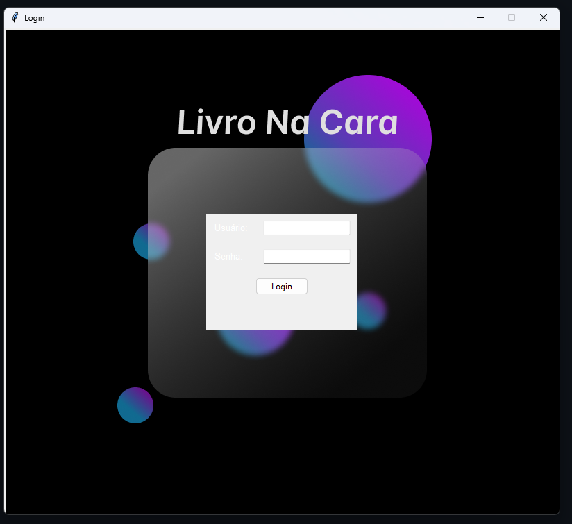
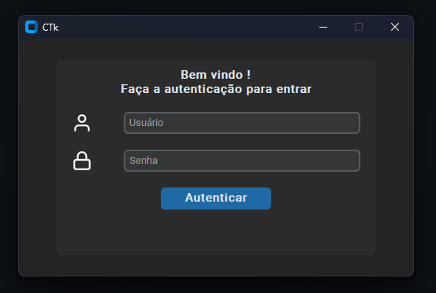

# Telas de login

As bibliotecas utilizadas neste projeto foram:

- tkinter
- custom tkinter

Em ambos os códigos assim que a autenticação é realizada, a tela de login é destruida para não consumir RAM de maneira desnecessária.

Ao entrar no app, há um botão para fazer logout, que irá destruir as telas e reecriar a tela de login

# utilização Tkinter



Para utilizar a biblioteca tkinter basta realizar o import no começo do código, ela já vem com o Python

```
from tkinter import *
# Para uma interface um pouco mais moderna utilize o ttk também
from tkinter import ttk
```

# utilização CustomTkinter



Para utilizar esta biblioteca se faz necessário fazer a instalação:

```
pip install customtkinter
```

Em seguida importar no código, como uma preferencia minha importo como ctk

```
import customtkinter as ctk
```

Documentação oficial Tkinter:

- https://github.com/TomSchimansky/CustomTkinter/tree/master
